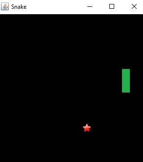

# javamid
 <strong>Title:</strong> Snake
 <strong>Repository Link:</strong> https://github.com/IndiRow/javamid
 <strong>Contact Person:</strong> 
                 <strong>Name:</strong>    Ilshat
                 <strong>Surname:</strong> Niyazov
                 <strong>e-mail:</strong> ilshat.niyazov@iaau.edu.kg
                 <strong>mobile:</strong> +996555122123

Project for the midterm exam
Snake (Python, Boa constrictor, Snake) - a computer game that arose in the mid or late 1970s.

The player controls a long, thin existing, resembling view that crawls along a plane (usually limited by walls), collects food (or other objects), avoiding a collision with its own tail and the edges of the playing field. In some cases, there are additional obstacles in the field. It becomes longer, which gradually complicates the game. The player controls the direction of head movement (usually 4 directions: up, down, left, right), the tail moves next. The player cannot stop the movement of the snake. 

